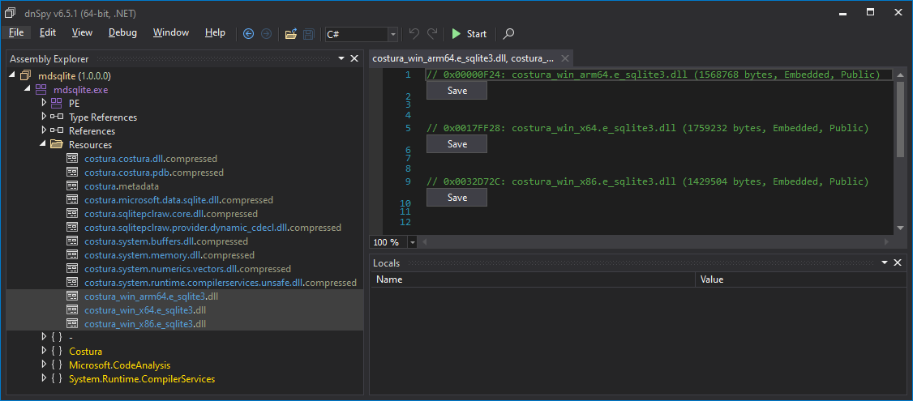

This project demonstrates how to package [Microsoft.Data.Sqlite](https://learn.microsoft.com/en-us/dotnet/standard/data/sqlite/) with [Costura](https://github.com/Fody/Costura) on .NET Framework (4.7.2)

## Instructions

1. Build the solution

```cmd
git clone https://github.com/0xced/mdsqlite-costura
cd mdsqlite-costura
dotnet build -c Release
```

This will build a single `mdsqlite.exe` executable that embeds all the required libraries as resources.



2. Run the executable

```cmd
.\src\bin\Release\net472\mdsqlite.exe
```

This will print

```
✔️ Microsoft.Data.Sqlite 9.0.0 is working with Costura and e_sqlite3 version 3.46.1
```

